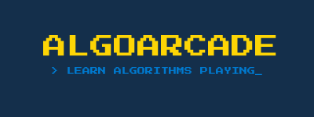

# AlgoArcade

Plataforma web educativa para el aprendizaje de algoritmia clásica mediante game-based learning. Disponible en producción en [alg0arcade.vercel.app](https://alg0arcade.vercel.app).

## ¿Qué es?

AlgoArcade convierte problemas algorítmicos clásicos en minijuegos interactivos. El usuario no observa la solución del sistema, sino que formula la suya propia y la compara contra el algoritmo.

**Minijuego del TSP (Problema del Viajante)**
- Modo libre: resolución manual y visualización animada de Nearest Neighbour y 2-opt
- Modo builder: construcción de instancias personalizadas
- Compartición de instancias por URL
- Modo competitivo: reto diario compartido con tabla de clasificación en tiempo real

**Minijuego de Pathfinding**
- Cuadrícula 21×41 con dos generadores de laberintos
- Visualización animada paso a paso de A\*, Dijkstra, BFS y DFS
- Modo manual: traza tu camino y compáralo contra el algoritmo

**Más**
- Blog educativo con artículos en Markdown
- Panel de administración (gestión de usuarios y blog)
- Sistema de autenticación con email/contraseña y Google Sign-In

## Stack

| Capa | Tecnología |
|---|---|
| UI | React 19 + TypeScript |
| Bundler | Vite 6 |
| Enrutamiento | React Router 7 |
| Estilos | CSS Modules |
| Auth | Firebase Authentication |
| Base de datos | Cloud Firestore |
| Despliegue | Vercel |
| CI/CD | GitHub Actions |

## Estructura del proyecto

```
TFG/
├── frontend/          # Aplicación React (SPA)
│   └── src/
│       ├── components/    # Componentes compartidos y de juego
│       ├── hooks/         # Custom hooks (lógica de negocio)
│       ├── pages/         # Vistas de la aplicación
│       ├── services/      # Capa de acceso a Firebase
│       ├── utils/         # Algoritmos y utilidades puras
│       ├── types/         # Definiciones TypeScript
│       └── context/       # AuthContext (estado de sesión global)
└── scripts/           # Scripts de GitHub Actions
    ├── generate-daily-challenge.js
    ├── award-daily-medals.js
    └── cleanup-shared-instances.js
```

## Desarrollo local

### Requisitos previos

- Node.js 18+
- Un proyecto de Firebase con Firestore y Authentication habilitados

### 1. Clonar e instalar dependencias

```bash
git clone https://github.com/danisntoss/TFG.git
cd TFG/frontend
npm install
```

### 2. Configurar variables de entorno

Crea un archivo `.env` en `frontend/` con las credenciales de tu proyecto Firebase:

```env
VITE_FIREBASE_API_KEY=
VITE_FIREBASE_AUTH_DOMAIN=
VITE_FIREBASE_PROJECT_ID=
VITE_FIREBASE_STORAGE_BUCKET=
VITE_FIREBASE_MESSAGING_SENDER_ID=
VITE_FIREBASE_APP_ID=
```

Puedes encontrar estos valores en la consola de Firebase: **Project Settings → General → Your apps → SDK setup and configuration**.

### 3. Configurar Firestore

En la consola de Firebase, ve a **Firestore Database → Rules** y pega las siguientes reglas de seguridad:

```
rules_version = '2';

service cloud.firestore {
  match /databases/{database}/documents {

    function isAuthenticated() {
      return request.auth != null;
    }

    function isOwner(userId) {
      return isAuthenticated() && request.auth.uid == userId;
    }

    function isAdmin() {
      return isAuthenticated() &&
        get(/databases/$(database)/documents/users/$(request.auth.uid)).data.role == "ADMIN";
    }

    match /users/{userId} {
      allow read: if true;
      allow create: if isOwner(userId);
      allow update: if (isOwner(userId) && request.resource.data.diff(resource.data).affectedKeys().hasOnly(['username', 'profilePic'])) || isAdmin();
      allow delete: if isOwner(userId);
    }

    match /blog_posts/{postId} {
      allow read: if resource.data.published == true || isAdmin();
      allow create, update, delete: if isAdmin();
    }

    match /tsp_daily_challenges/{challengeId} {
      allow read: if true;
      allow write: if false;
    }

    match /tsp_leaderboards/{dateString}/scores/{userId} {
      allow read: if true;
      allow create: if isOwner(userId);
      allow update, delete: if false;
    }

    match /tsp_instances/{instanceId} {
      allow read: if true;
      allow create: if true;
      allow update, delete: if false;
    }

    match /{document=**} {
      allow read, write: if false;
    }
  }
}
```

### 4. Arrancar el servidor de desarrollo

```bash
npm run dev
```

La aplicación estará disponible en `http://localhost:5173`.

### Otros comandos

```bash
npm run build    # Compilar para producción
npm run preview  # Previsualizar el build de producción
npm run lint     # Ejecutar ESLint
```

## Despliegue en producción

El proyecto está configurado para desplegarse automáticamente en Vercel. Cada push a `main` dispara un nuevo despliegue.

Para configurar tu propio despliegue:

1. Importa el repositorio en [vercel.com](https://vercel.com)
2. Establece el directorio raíz como `frontend/`
3. Añade las variables de entorno (`VITE_FIREBASE_*`) en **Project Settings → Environment Variables**

## Retos diarios (GitHub Actions)

Los scripts de `scripts/` se ejecutan automáticamente mediante GitHub Actions:

- **`generate-daily-challenge.js`** — genera la instancia del reto diario cada día a las 00:00 UTC
- **`award-daily-medals.js`** — recoge los resultados y asigna medallas a los participantes
- **`cleanup-shared-instances.js`** — elimina instancias compartidas con más de 7 días de antigüedad

Para que funcionen necesitan acceso a Firebase Admin SDK. Añade tu `FIREBASE_SERVICE_ACCOUNT` como secreto en **GitHub → Settings → Secrets and variables → Actions**.

## Trabajo Fin de Grado

Este proyecto es el resultado del TFG *"AlgoArcade: Plataforma Web Educativa para el Aprendizaje de Algoritmia mediante Game-Based Learning"* del Grado en Ingeniería del Software de la URJC.
